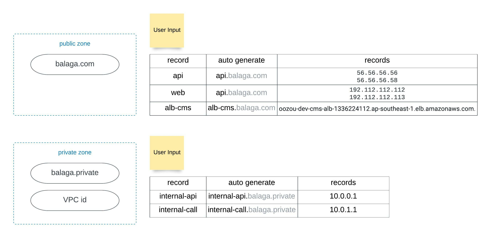

# terraform-aws-route53

## Terraform module design



## Usage

```terraform
resource "aws_elb" "this" {
  name    = "foobar-terraform-elb"
  subnets = "vpc-xxxxx"

  listener {
    instance_port     = 80
    instance_protocol = "http"
    lb_port           = 80
    lb_protocol       = "http"
  }
}

module "host_zone_and_record" {
  source = "<source>"

  is_public_zone = false             # Default `true`
  vpc_id         = "vpc-xxxxx"  # If is_public_zone is `true`, no need to specific

  prefix      = "oozou"
  environment = "dev"

  dns_name = "oozou-sample"
  dns_records = {
    sample_dns = {
      name    = "app1" 
      type    = "A"
      ttl     = "5"
      records = ["192.112.112.112", "192.112.112.113"]
    }
    sample_alias = {
      name = "app2"
      type = "A"
      alias = {
        name    = aws_elb.this.dns_name # Target DNS name
        zone_id = aws_elb.this.zone_id
      }
    }
  }

  tags = var.custom_tags
}

module "only_record" {
  source = "<source>"
  depends_on = [module.host_zone_and_record]
  is_create_zone = false
  is_public_zone = false             # Default `true`
  vpc_id         = "vpc-xxxxx"  # If is_public_zone is `true`, no need to specific

  prefix      = "oozou"
  environment = "dev"

  dns_name = "oozou-sample"

  dns_records = {
    sample_dns = {
      name    = "app2" 
      type    = "A"
      ttl     = "5"
      records = ["192.112.112.114", "192.112.112.115"]
    }
  }
}
```

<!-- BEGIN_TF_DOCS -->
## Requirements

| Name                                                                      | Version  |
|---------------------------------------------------------------------------|----------|
| <a name="requirement_terraform"></a> [terraform](#requirement\_terraform) | >= 1.0.0 |
| <a name="requirement_aws"></a> [aws](#requirement\_aws)                   | >= 4.00  |

## Providers

| Name                                              | Version |
|---------------------------------------------------|---------|
| <a name="provider_aws"></a> [aws](#provider\_aws) | 4.6.0   |

## Modules

No modules.

## Resources

| Name                                                                                                                          | Type        |
|-------------------------------------------------------------------------------------------------------------------------------|-------------|
| [aws_route53_record.this](https://registry.terraform.io/providers/hashicorp/aws/latest/docs/resources/route53_record)         | resource    |
| [aws_route53_zone.this](https://registry.terraform.io/providers/hashicorp/aws/latest/docs/resources/route53_zone)             | resource    |
| [aws_route53_zone.selected_zone](https://registry.terraform.io/providers/hashicorp/aws/latest/docs/data-sources/route53_zone) | data source |

## Inputs

| Name                                                                             | Description                                                                          | Type          | Default | Required |
|----------------------------------------------------------------------------------|--------------------------------------------------------------------------------------|---------------|---------|:--------:|
| <a name="input_dns_name"></a> [dns\_name](#input\_dns\_name)                     | (Required) This is the name of the hosted zone.                                      | `string`      | n/a     |   yes    |
| <a name="input_dns_records"></a> [dns\_records](#input\_dns\_records)            | Map of DNS records                                                                   | `any`         | `{}`    |    no    |
| <a name="input_environment"></a> [environment](#input\_environment)              | Environment Variable used as a prefix                                                | `string`      | n/a     |   yes    |
| <a name="input_is_create_zone"></a> [is\_create\_zone](#input\_is\_create\_zone) | Wherther to create a zone or not                                                     | `bool`        | `true`  |    no    |
| <a name="input_is_public_zone"></a> [is\_public\_zone](#input\_is\_public\_zone) | Wherther to create a zone or not                                                     | `bool`        | `true`  |    no    |
| <a name="input_prefix"></a> [prefix](#input\_prefix)                             | The prefix name of customer to be displayed in AWS console and resource              | `string`      | n/a     |   yes    |
| <a name="input_tags"></a> [tags](#input\_tags)                                   | Tags to add more; default tags contian {terraform=true, environment=var.environment} | `map(string)` | `{}`    |    no    |
| <a name="input_vpc_id"></a> [vpc\_id](#input\_vpc\_id)                           | Required when hostzone is private, to associate with VPC                             | `string`      | `""`    |    no    |

## Outputs

| Name                                                                                                 | Description                               |
|------------------------------------------------------------------------------------------------------|-------------------------------------------|
| <a name="output_route53_name"></a> [route53\_name](#output\_route53\_name)                           | Name of Route53 zone                      |
| <a name="output_route53_name_servers"></a> [route53\_name\_servers](#output\_route53\_name\_servers) | Name servers of Route53 zone              |
| <a name="output_route53_record_fqdn"></a> [route53\_record\_fqdn](#output\_route53\_record\_fqdn)    | FQDN built using the zone domain and name |
| <a name="output_route53_record_name"></a> [route53\_record\_name](#output\_route53\_record\_name)    | The name of the record                    |
| <a name="output_route53_zone_id"></a> [route53\_zone\_id](#output\_route53\_zone\_id)                | Zone ID of Route53 zone                   |
<!-- END_TF_DOCS -->
